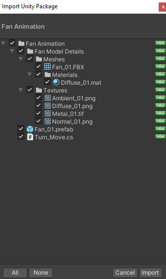

# VERTIGO DEMO PROJECT

## DEFINITION
You are going to prepare a game where the player tries to rotate hexagonal tiles in order to create certain patterns. The game we want already exists, designed by Alexey Pajitnov is also known as the creator of Tetris. You can find the example game in the store:

https://play.google.com/store/apps/details?id=com.rippalka.hexfall&hl=en

## REQUIREMENTS
* The demo will be tested on the builded apk file.
* Project name Should be Hexagon+YourName. Example: “HexagonBuket”
* The core mechanic should be provided: Select a hexagonal group and turn them clockwise or counterclockwise. If a 3-hexagonal group of the same color occurs, they should be exploded, if not the hexagonal pieces should return to the initial state.
* The game grid should be changeable from the editor easily. The default grid is 8x9.
* Colors and color count of the hexagons should also be changeable from the editor easily. By default, there are 5 colors.
* Scoring is 5 times the exploded block count.
* A bomb hexagon should appear on every 1000 score. The bomb’s function is to count from a number every time an action is made on the board. When the number reaches zero, a bomb explodes and the game is lost. You can check the example game given to understand this requirement better.
* The game is over when there are no more available moves left or a bomb explodes.
* You are allowed to use 3rd party assets of your choice.
* The demo should contain these elements:
* Core mechanic(this includes colors of the hexagons)
    * Grid system
    * Scoring
    * Bomb hexagon
    * Game over logic

Your project will be reviewed on these conditions, please read carefully:
* Clean, reusable, modular code.
* OOP principles and concepts.
* Lean and reusable UI design.
* Codebase architecture according to features requested.

The duration of the project is 5 days

## Uygulamanın UnityPackage File Dosyası

Uygulamanın UnityPackage file dosyasına Assets -> 1Giris bölümünden erişebilirsiniz. İlgili dosyayı kullanmak için  Unity menü bar sekmesinden Assets seçilir.

Daha sonra Import Package -> Custom Package seçenekleri ile import edilecek olan dosya seçilir.

Sağ altta bulunan import butonuna tıklanarak dosyalar projeye dahil edilir.

Her türlü soru için iletişim e-postası: info@sinanozcelik.com

Daha fazlası için: sinanozcelik.com